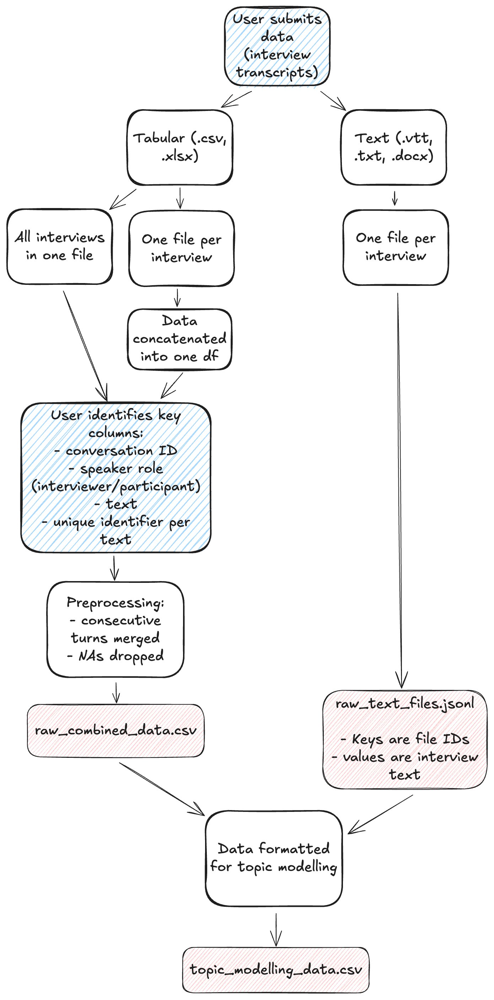

# QualFML app logic

This doc contains info on the processing logic behind each of the 3 tabs in the QualFML app.

NB the logic behind the research question tab is the most complex, so this is in its own doc: [docs/top_down_approach.md](top_down_approach.md).

## Data upload and processing

We assume that the data will either be uploaded as:

- a text file (e.g. `.txt`, `.vtt`, `.docx`), one per interview

- a table format (e.g. `.csv`, `.xlsx`), one per interview

- a table format (e.g. `.csv`, `.xlsx`) containing ALL interviews

The preprocessing steps are more complicated if the data is in table form, but this has benefits - e.g. consecutive turns are merged in tabular data where the speaker role can be identified.

Depending on input data type, two outputs are saved:

- Raw data is concatenated and saved as `raw_text_files.jsonl` for text formats, `raw_combined_data.csv` for table formats.

- A tabular form of the data, suitable for topic modelling, is created and saved as `topic_modelling_data.csv`.

This process is represented in the diagram below.

## Topic modelling tab

This tab allows the user to input a desired maximum number of topics, and then uses BERTopic to run a topic model on the data (`topic_modelling_data.csv`).

The user journey is essentially:

1. Set number of topics
2. Click "Run"
3. Wait for results...
4. Get a high-level view of the topics from the table
5. Explore the scatterplot: click on a point to see the topic name and description, and read the quote in the context of the full transcript below.

## Research question answering tab

See [docs/top_down_approach.md](docs/top_down_approach.md)
