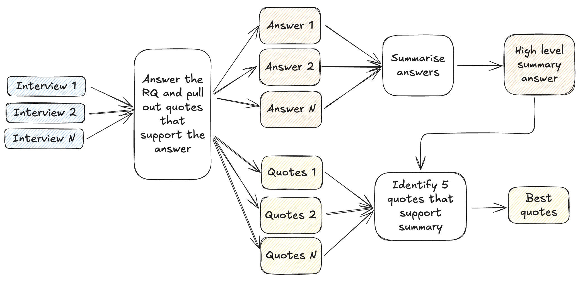

# Overview of the process

The diagram below represents what the process looks like **for each single RQ**.

It can be seen that there are THREE separate LLM prompting steps:

1. An answer to each RQ is generated for each conversation/file, and supporting quotes from that conversation/file are pulled out.

2. The answers to each RQ are summarized across all conversations/files.

3. Given the summary answer from step (2), and the quotes from step (1), the LLM is asked to return the quotes that best support the summary answer.

Between steps (1) and (2), and between (3) and displaying the output in the app, there are checks to make sure that exact matches for the returned quotes can be found in the original data. Any quotes not found will be filtered out.

# Specific functions called

The functions that are used internally for the research question answering functionality are as follows:

- `parse_rqs()`: creates a Dict mapping an ID for each research question to the question text itself. The ID contains a timestamp so that if the user changes the question, a new ID is generated.
  (Previously, the ID was just an integer, and then we had issues where the app would return answers and quotes to the previously submitted RQ rather than the current one.)

- `format_transcripts()`: turns the data into a Python dict where the keys are file/conversation IDs, and the values are strings containing the entire content of that file/interview.

- `run_batch_check_for_all_rqs()`

  - `build_question_prompt_dict()`: creates a nested dict, where the outer keys are question IDs, and the values are dicts of the form `{"system_message": system_message, "fields": fields}`
  - `run_batch_check()`: loops over the RQs and for each one runs `batch_check.LLMProcessor()` — which in turn loops over the individual conversations/texts.

- `create_batch_check_outputs_all_rqs()`: turns batch check output into a DataFrame

  - `create_batch_check_output_single_rq()`: turns batch check output into a long-form DataFrame (one row per quote)
    - `check_quotes_were_in_original()`: identifies quotes that have been hallucinated
    - Hallucinated quotes are removed

- `generate_summaries_and_quotes()`: generates summaries and quotes for _all_ RQs

  - `summarize_and_quote()`: gets summary answer and quotes for ONE RQ

- `create_final_output_df()`

  - `identify_source_of_quote()`: for each quote returned, maps it to a source/file ID
  - Quotes that could not be mapped to a file are filtered out
  - The summaries and quotes for all RQs are concatenated into one DataFrame

- `create_output_excel()`
  - `merge_column()`: merges rows within the 'question' and 'answer' columns that have identical values
